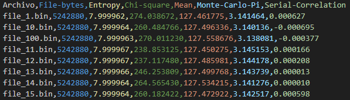

## **Introducción**
Para evaluar si los generadores se comportan de forma aleatoria, existen varias baterías de pruebas estadísticas. ENT es una de las más sencillas y populares, al menos en parte debido a su eficacia y velocidad. No obstante, solo una de las pruebas de esta suite proporciona un $p-valor$, que es la forma más útil y estándar de determinar si la hipótesis de aleatoriedad se cumple para un cierto nivel de significación. Como consecuencia de esto, se establecen límites bastante arbitrarios y a veces engañosos para decidir qué intervalos son aceptables para sus resultados. El  artículo ``StringENT test suite: ENT battery revisited for efficient P value computation``, presenta una extensión de la batería, denominada StringENT, que, si bien se mantiene a la alta velocidad que hace que ENT sea popular y útil, aún logra proporcionar $p-valores$ con los que se pueden tomar decisiones acertadas sobre la aleatoriedad de una secuencia. 

El conjunto de pruebas ENT consta de las siguientes estadísticas: **Entropía** (tasa de compresión ideal) , **Prueba de Chi-cuadrado**, **Media Aritmética**, **Estimación de Monte Carlo de π** y **Correlación Serial**. La prueba de Chi-cuadrado es la única que genera un $p-valor$ aproximado, que ayuda a determinar si la secuencia es significativamente no aleatoria. Esto significa que la interpretación del resto de las estadísticas no es trivial. Correlación serial es la única prueba de la serie ENT original que intenta, hasta cierto punto, medir la independencia, a diferencia de las otras que se ocupan exclusivamente de la uniformidad.

Para ejecutar la batería de pruebas de ETN redirigirse a https://www.fourmilab.ch/random/
###  **Resultados de la aplicación de la batería de test ENT en el archivo `ethereum.jpg`**
`
<div style="text-align: center;">
    
</div>

### **Resumen 1: Ejecución en Bytes (`./ent ethereum.jpg`)**

Al procesar la foto `ethereum.jpg` como un archivo en bytes, se obtuvieron los siguientes resultados:

<div style="text-align: center;">
    
</div>


- **Entropía:** 7.952486 bits por byte, lo que indica que el archivo es altamente denso en información, cercano al máximo de 8 bits por byte. Esto implica que el contenido es esencialmente aleatorio, y la compresión óptima no reduciría su tamaño.
- **Prueba de Chi-cuadrado:** El valor de 3722.34 con una probabilidad de excedencia menor al 0.01% sugiere que los datos presentan características alejadas de la aleatoriedad ideal.
- **Media aritmética:** 124.0567 (en comparación con el valor ideal de 127.5 para datos completamente aleatorios). Esto indica ligeros sesgos en la distribución de los valores.
- **Valor de Monte Carlo para Pi:** 3.172040364, con un error del 0.97%. Aunque cercano a Pi, refleja cierta desviación, mostrando que la aleatoriedad no es perfecta.
- **Coeficiente de correlación serial:** 0.087175, lo que indica una baja correlación entre bytes consecutivos, aunque no completamente independiente.

En resumen, los resultados muestran que el archivo tiene alta densidad de información, pero con patrones detectables que limitan su aleatoriedad ideal.

### **Resumen 2: Ejecución en Bits (`./ent ethereum.jpg -b`)**

Al evaluar la foto `ethereum.jpg` procesada en bits, los resultados fueron:

<div style="text-align: center;">
    
</div>


- **Entropía:** 0.999498 bits por bit, muy cercana al máximo de 1, lo que demuestra una alta aleatoriedad en los bits individuales del archivo. No se observa posibilidad de compresión adicional.
- **Prueba de Chi-cuadrado:** Con un valor de 271.66 y una probabilidad de excedencia menor al 0.01%, los datos muestran una notable desviación respecto a la aleatoriedad ideal.
- **Media aritmética:** 0.4868 (en comparación con el ideal de 0.5), lo que señala un ligero desequilibrio en la proporción de ceros y unos.
- **Valor de Monte Carlo para Pi:** 3.172040364, con un error del 0.97%, mostrando consistencia con la ejecución en bytes, pero indicando nuevamente cierta falta de aleatoriedad perfecta.
- **Coeficiente de correlación serial:** -0.016110, lo que refleja que los bits están casi completamente descorrelacionados.

En síntesis, los datos en bits presentan una alta entropía, con solo pequeñas desviaciones respecto a la aleatoriedad, pero las pruebas revelan patrones sutiles.

### **Independencia de las pruebas**

Estudiamos también las pruebas en ENT con datos pseudoaleatorios de buena calidad, analizando 100 archivos de 5 MB de tamaño, extraídos del PRNG /dev/urandom de Unix. En primer lugar, ejecutamos la suite para calcular las 500 estadísticas resultantes.
#### Obtener datos pseudoaleatorios 

##### Obtener datos pseudoaleatorios 

```bash
sudo bash -c 'for i in $(seq 1 100); do
  dd if=/dev/urandom of=file_$i.bin bs=1M count=5 >/dev/null 2>&1
done'

```

Script `procesar_ent.sh`

```bash
bash ./procesar_ent.sh
Procesando: 100% (100 de 100 archivos)
Proceso completado.
```

Al procesar la muestra obtenemos un archivo `resultados.csv` con el fin de observar el comportamiento de los datos.

<div style="text-align: center;">
    
</div>


<div style="text-align: center;">
    
</div>

<div style="text-align: center;">
    
</div>

<div style="text-align: center;">
    
</div>

<div style="text-align: center;">
    
</div>

<div style="text-align: center;">
    
</div>


### Media aritmética

Se expresa como el resultado de sumar todos los bytes (o bits) del archivo y dividirlo por la longitud del archivo. Si los datos son casi aleatorios, debería ser aproximadamente 127,5 (0,5 para bits). Esta valor esperado de 127,5 como media aritmética de todos los bytes observados  se da por la interpretación de los los bytes como números enteros entre 0 y 255. La media aritmética es posiblemente la estadística más simple de la batería. Para una secuencia $x = x_0...x_{n-1}$, obtenemos la estadística
$$\overline{x} = \dfrac{1}{n}\sum_{i=0}^{n-1} x_i$$

Una de las mejoras más obvias que podría utilizar la batería es ofrecer p-valores a partir de las estadísticas que no lo proporcionan (**Entropía**, **Chi-cuadrado****, **Media aritmética**, **Valor de Monte Carlo para Pi**, **Coeficiente de correlación serial**). Esto nos permitiría realizar pruebas de hipótesis adecuadas, con el fin de encontrar resultados estadísticos sólidos a partir de los cuales podamos concluir si la prueba de hipótesis puede rechazarse. 

$H_0$ (Hipótesis Nula): secuencia de bytes es verdaderamente aleatoria

Por ejemplo, digamos que tenemos una secuencia con media aritmética 127.8723. ¿Cómo sabemos si esto está demasiado lejos de 127.5? Eso dependerá de la longitud de la secuencia. Esa aproximación puede ser excelente para una secuencia de 60 bytes, pero extremadamente deficiente para un archivo de 20 MB. Sin embargo, existen algunas derivaciones mediante las cuales podemos proporcionar un $p-valor$, que nos indicará qué probabilidad habría de obtener resultados “más extremos” que los observados si la secuencia fuera verdaderamente aleatoria.

Es sencillo hallar $\mu$ y $\sigma$. Como $Y$ es una distribución uniforme discreta entre 0 y 255 $(Y ≃ U\{0, 255\})$, obtenemos:

1- **Media esperada**: Para una secuencia de bytes generados aleatoriamente con distribución uniforme, la media esperada es $\mu = \frac{255}{2} = 127.5$. O lo que  formalmente se traduce en los siguiente: $$\mu = \mathbb{E}[Y] = \sum_{i=0}^{255}i \cdot P_Y(i) = \frac{1}{256} \sum_{i=0}^{255} i = 127.5$$
2 - **Distribución uniforme de los bytes**: Los valores de un byte están distribuidos uniformemente en el rango de $[0,255]$. Esto significa que cada valor entre 0 y 255 tiene la misma probabilidad de ocurrir. Para una distribución uniforme $U(a,b)$, la desviación estándar se calcula como:

$$\sigma = \sqrt{\dfrac{(b - a + 1)^2 - 1}{12}} = \sqrt{\dfrac{256^2 - 1}{12}} = \sqrt{\dfrac{65535}{12}} = 73.9 $$
La desviación estándar $\sigma \approx 73.9$ refleja la dispersión típica de los valores de bytes generados aleatoriamente en $[0,255]$. Dado que la distribución es uniforme, los valores están bastante dispersos, lo que se traduce en una desviación estándar relativamente alta.

Cuando usamos esta desviación estándar para calcular el error estándar de la media (SEM= $\sigma / \sqrt{n}$), obtenemos una medida de cuánto puede variar la media observada respecto a la media esperada $(μ=127.5)$ debido al tamaño de la muestra $n$. Esto explica por qué una media de 127.8723 podría ser razonable para 60 bytes pero sospechosa para 20 MB.

**Influencia del tamaño de la muestra**:
- Para muestras pequeñas ($n$ pequeño), el error estándar es grande, lo que significa que una desviación de 127.5 (por ejemplo, 127.8723) puede no ser estadísticamente significativa.
- Para muestras grandes ($n$ grande), el error estándar se reduce considerablemente, lo que implica que incluso una pequeña desviación de 127.5 puede ser estadísticamente significativa.
1-  **Secuencia de 60 bytes**:
    - Tamaño de la muestra: $n=60$.
    - SEM: $\frac{73.9}{\sqrt{60}} \approx 9.54$.
    - Si observamos una media de 127.8723, la desviación respecto a 127.5 es $|127.8723 - 127.5| \approx 0.3723$, que está dentro de un rango plausible considerando el SEM grande.
 2- **Secuencia de 20 MB**:
    - Tamaño de la muestra: $n = 20 \, \text{MB} = 20 \times 1024 \times 1024 = 20,971,520$.
    - SEM: $\frac{73.9}{\sqrt{20,971,520}} \approx 0.00051$.
    - La misma desviación de 0.3723 sería extremadamente grande comparada con el SEM, lo que indicaría una fuerte evidencia de no aleatoriedad


Por lo tanto, podemos obtener un $p-valor$ de dos colas. Primero calculamos el siguiente estadístico $z$: $$z = \sqrt[]{n}\dfrac{\overline{x}- \mu}{\sigma}$$
Según la hipótesis de aleatoriedad, $z$ seguirá aproximadamente una distribución normal estándar. $z$ estará cerca de 0 si la media estaba cerca de 127,5. Por lo tanto, los resultados “más extremos” que $z$ son aquellos que tienen un valor absoluto mayor que $|z|$. Ahora bien, si denotamos por $\Phi$ la distribución normal estándar acumulativa, obtenemos el $p-valor$ de la siguiente ecuación, que se asemeja a los $p-valores$ de dos colas. El **p-valor** de dos colas evalúa si el valor observado $z$ es significativamente diferente de 0 en **ambas direcciones** (es decir, tanto positivo como negativo). Se utiliza cuando queremos detectar desviaciones en cualquier dirección, no solo en una.

$$p = P(| Z |≥| z |) = 2 · (1 − \Phi(| z |))$$
donde:

- $|Z|$ es el valor absoluto de $Z$ (porque evaluamos desviaciones en ambas direcciones),
- $\Phi(|z|)$ es la función de distribución acumulativa de la normal estándar, que nos da la probabilidad de que $Z \leq |z|$,
- $\Phi$ tiene una aproximación numérica al valor de $\chi^2_{255}$ ,
- $1 - \Phi(|z|)$ es la probabilidad de que $Z > |z|$,
- El factor $2$ incluye la probabilidad de valores extremos en ambas colas (positiva y negativa).

Por ejemplo:

- Si $z = 0$, $p=1$, porque $Z=0$ está perfectamente alineado con la hipótesis nula.
- Si $z$ es muy grande o muy pequeño (en valor absoluto), $p$ será pequeño, indicando un resultado extremo que podría sugerir no aleatoriedad.

El uso del p-valor convierte la evaluación de la media aritmética en una prueba formal de hipótesis. Nos permite determinar si una desviación de $127.5$ (como $127.8723$) es estadísticamente significativa, dependiendo del tamaño de la secuencia ($n$). Por ejemplo:

- Para una secuencia corta ($n=60$), una desviación pequeña podría ser aceptable debido al azar.
- Para una secuencia larga ($n = 20 \, \text{MB}$), una desviación similar indicaría un problema serio con la aleatoriedad.