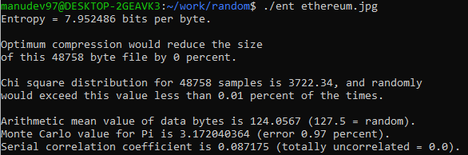

## **Introducción**
Para evaluar si los generadores se comportan de forma aleatoria, existen varias baterías de pruebas estadísticas. ENT es una de las más sencillas y populares, al menos en parte debido a su eficacia y velocidad. No obstante, solo una de las pruebas de esta suite proporciona un $p-valor$, que es la forma más útil y estándar de determinar si la hipótesis de aleatoriedad se cumple para un cierto nivel de significación. Como consecuencia de esto, se establecen límites bastante arbitrarios y a veces engañosos para decidir qué intervalos son aceptables para sus resultados. El  artículo ``StringENT test suite: ENT battery revisited for efficient P value computation``, presenta una extensión de la batería, denominada StringENT, que, si bien se mantiene a la alta velocidad que hace que ENT sea popular y útil, aún logra proporcionar $p-valores$ con los que se pueden tomar decisiones acertadas sobre la aleatoriedad de una secuencia. 

El conjunto de pruebas ENT consta de las siguientes estadísticas: **Entropía** (tasa de compresión ideal) , **Prueba de Chi-cuadrado**, **Media Aritmética**, **Estimación de Monte Carlo de π** y **Correlación Serial**. La prueba de Chi-cuadrado es la única que genera un $p-valor$ aproximado, que ayuda a determinar si la secuencia es significativamente no aleatoria. Esto significa que la interpretación del resto de las estadísticas no es trivial. Correlación serial es la única prueba de la serie ENT original que intenta, hasta cierto punto, medir la independencia, a diferencia de las otras que se ocupan exclusivamente de la uniformidad.

Para ejecutar la batería de pruebas de ETN redirigirse a https://www.fourmilab.ch/random/
###  **Resultados de la aplicación de la batería de test ENT en el archivo `ethereum.jpg`**
`
<div style="text-align: center;">
    
</div>

### **Resumen 1: Ejecución en Bytes (`./ent ethereum.jpg`)**

Al procesar la foto `ethereum.jpg` como un archivo en bytes, se obtuvieron los siguientes resultados:

<div style="text-align: center;">
    
</div>


- **Entropía:** 7.952486 bits por byte, lo que indica que el archivo es altamente denso en información, cercano al máximo de 8 bits por byte. Esto implica que el contenido es esencialmente aleatorio, y la compresión óptima no reduciría su tamaño.
- **Prueba de Chi-cuadrado:** El valor de 3722.34 con una probabilidad de excedencia menor al 0.01% sugiere que los datos presentan características alejadas de la aleatoriedad ideal.
- **Media aritmética:** 124.0567 (en comparación con el valor ideal de 127.5 para datos completamente aleatorios). Esto indica ligeros sesgos en la distribución de los valores.
- **Valor de Monte Carlo para Pi:** 3.172040364, con un error del 0.97%. Aunque cercano a Pi, refleja cierta desviación, mostrando que la aleatoriedad no es perfecta.
- **Coeficiente de correlación serial:** 0.087175, lo que indica una baja correlación entre bytes consecutivos, aunque no completamente independiente.

En resumen, los resultados muestran que el archivo tiene alta densidad de información, pero con patrones detectables que limitan su aleatoriedad ideal.

### **Resumen 2: Ejecución en Bits (`./ent ethereum.jpg -b`)**

Al evaluar la foto `ethereum.jpg` procesada en bits, los resultados fueron:

<div style="text-align: center;">
    
</div>


- **Entropía:** 0.999498 bits por bit, muy cercana al máximo de 1, lo que demuestra una alta aleatoriedad en los bits individuales del archivo. No se observa posibilidad de compresión adicional.
- **Prueba de Chi-cuadrado:** Con un valor de 271.66 y una probabilidad de excedencia menor al 0.01%, los datos muestran una notable desviación respecto a la aleatoriedad ideal.
- **Media aritmética:** 0.4868 (en comparación con el ideal de 0.5), lo que señala un ligero desequilibrio en la proporción de ceros y unos.
- **Valor de Monte Carlo para Pi:** 3.172040364, con un error del 0.97%, mostrando consistencia con la ejecución en bytes, pero indicando nuevamente cierta falta de aleatoriedad perfecta.
- **Coeficiente de correlación serial:** -0.016110, lo que refleja que los bits están casi completamente descorrelacionados.

En síntesis, los datos en bits presentan una alta entropía, con solo pequeñas desviaciones respecto a la aleatoriedad, pero las pruebas revelan patrones sutiles.

### **Independencia de las pruebas**

Estudiamos también las pruebas en ENT con datos pseudoaleatorios de buena calidad, analizando 100 archivos de 5 MB de tamaño, extraídos del PRNG /dev/urandom de Unix. En primer lugar, ejecutamos la suite para calcular las 500 estadísticas resultantes.
#### Obtener datos pseudoaleatorios 

```bash
sudo bash -c 'for i in $(seq 1 100); do
  dd if=/dev/urandom of=file_$i.bin bs=1M count=5 >/dev/null 2>&1
done'

```

Script `procesar_ent.sh`

```bash
#!/bin/bash
# Directorio con los archivos a procesar
DIRECTORIO="./urandom"
# Archivo de salida para resultados
RESULTADOS="resultados.csv"
# Contar el número total de archivos en el directorio
TOTAL_ARCHIVOS=$(find "$DIRECTORIO" -type f | wc -l)
# Escribe encabezado para los resultados
echo "Archivo,File-bytes,Entropy,Chi-square,Mean,Monte-Carlo-Pi,Serial-Correlation" > $RESULTADOS
# Contador para los archivos procesados
PROCESADOS=0
# Procesa cada archivo en el directorio
for ARCHIVO in "$DIRECTORIO"/*; do
    if [ -f "$ARCHIVO" ]; then
        # Ejecuta ent y guarda el resultado
        SALIDA=$(./ent -t "$ARCHIVO")
        # Extrae los datos en formato CSV directamente de la salida de ent
        DATOS=$(echo "$SALIDA" | sed -n '2p')
        # Agrega el nombre del archivo y los datos al archivo de resultados
        echo "$(basename "$ARCHIVO"),$DATOS" >> $RESULTADOS
        # Actualiza el contador de archivos procesados
        PROCESADOS=$((PROCESADOS + 1))
        # Calcula el porcentaje de progreso
        PORCENTAJE=$((PROCESADOS * 100 / TOTAL_ARCHIVOS))
        # Muestra el porcentaje en pantalla
        echo -ne "Procesando: $PORCENTAJE% ($PROCESADOS de $TOTAL_ARCHIVOS archivos)\r"
    fi
done
# Nueva línea después de la barra de progreso para que no quede sobreescrito
echo -e "\nProceso completado."
```

<div style="text-align: center;">
    
</div>

<div style="text-align: center;">
    
</div>

<div style="text-align: center;">
    
</div>

<div style="text-align: center;">
    
</div>

<div style="text-align: center;">
    
</div>


### Media aritmética

Se expresa como el resultado de sumar todos los bytes (o bits) del archivo y dividirlo por la longitud del archivo. Si los datos son casi aleatorios, debería ser aproximadamente 127,5 (0,5 para bits). Esta valor esperado de 127,5 como media aritmetica de todos los bytes observados  se da por la interpretacion de los los bytes como números enteros entre 0 y 255.
$$\overline{x} = \dfrac{1}{n}\sum_{i=0}^{n-1} x_i$$

Una de las mejoras más obvias que podría utilizar la batería es ofrecer $p-valores$ a partir de las estadísticas que no lo proporcionan (**Entropía**, **Entropía**, **Media aritmética**, **Valor de Monte Carlo para Pi**, **Coeficiente de correlación serial**). Esto nos permitiría realizar pruebas de hipótesis adecuadas, con el fin de encontrar resultados estadísticos sólidos a partir de los cuales podamos concluir si la prueba de hipótesis puede rechazarse. Por ejemplo, digamos que tenemos una secuencia con media aritmética 127.9523. ¿Cómo sabemos si esto está demasiado lejos de 127.5?
Eso dependerá de la longitud de la secuencia. Esa aproximación puede ser excelente para una secuencia de 50 bytes, pero extremadamente deficiente para un archivo de 20 MB. Sin embargo, existen algunas derivaciones mediante las cuales podemos proporcionar un p-valor, que nos indicará qué probabilidad habría de obtener resultados “más extremos” que los observados si la secuencia fuera verdaderamente aleatoria.

Note que la media aritmética es posiblemente la estadística más simple de la batería. Para una secuencia $x = x_0...x_{n-1}$, obtenemos la estadística $\overline{x} = \dfrac{1}{n}\sum_{i=0}^{n-1} x_i$. 